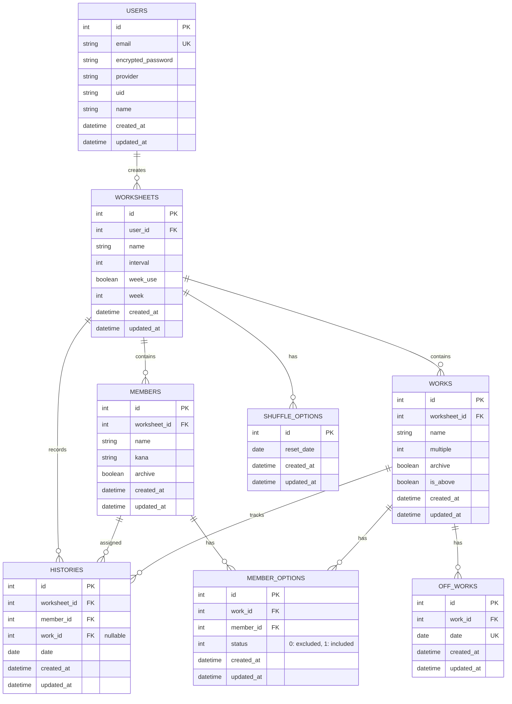

# タスクの割り当てシャッフルアプリ - TaskWheel

Rails 7 + React 18 + TypeScript + PostgreSQL + Docker + Tailwind CSSで構築された、マルチテナント対応の掃除タスク管理アプリケーション。

## 特徴

- **マルチテナント対応**: ユーザーごとに独立したワークシート管理
- **ユーザー認証**: Google OAuth + Devise によるセキュアなログイン
- **モダンなUI**: Tailwind CSS + React による レスポンシブデザイン
- **フルスタック TypeScript**: フロントエンド・バックエンド共に型安全
- **RESTful API**: Rails による マイクロサービスアーキテクチャ
- **自動テスト**: RSpec + Vitest による 包括的なテストカバレッジ
- **Docker対応**: 簡単なセットアップと開発環境の構築

## 機能

### 認証・ユーザー管理

- Google OAuth による ログイン
- メールアドレス・パスワード によるサインアップ
- パスワードリセット機能
- デモアカウント対応

### ワークシート管理

- 複数のワークシート（シフト管理セット）をサポート
- ワークシート名の編集
- ワークシートごとの独立したメンバー・タスク管理

### メンバー管理

- メンバー情報の登録・編集・削除
- 名前（フリガナ対応）の管理
- アーカイブ機能で過去メンバーを非表示化
- 一括インポート/エクスポート機能

### タスク管理

- タスク（掃除タスク）の登録・編集・削除
- 複数割り当て機能（multiple フラグ）
- 優先度管理（is_above フラグ）
- メンバーごとのタスク実績制限（MemberOption）
- 指定日のタスク除外（OffWork）

### 自動シャッフル

- ワンクリックでタスクを自動割り当て
- 週間モード/日数間隔モードの切り替え
- 公平性スコア計算による バランスの取れた割り当て
- メンバーごとの実績履歴を考慮

### 割り当て管理

- ダッシュボードでの日別タスク割り当て表示
- 割り当て先の変更機能
- 履歴管理

### 履歴管理

- タスク割り当ての履歴を記録
- 月ごとの履歴表示・検索
- メンバー・タスク単位での実績確認

## セットアップ

### 前提条件

- Docker & Docker Compose
- (オプション) Ruby 3.2+, Node.js 18+

### インストール

1. **プロジェクトのクローン**

```bash
cd TaskWheel
```

2. **.envファイルの設定**

```bash
cp .env.example .env
```

Googleログインを利用する場合は、`.env` に以下を設定してください。

```bash
GOOGLE_CLIENT_ID=your_google_client_id
GOOGLE_CLIENT_SECRET=your_google_client_secret
```

Google Cloud Console 側では OAuth クライアント（Webアプリ）を作成し、承認済みリダイレクト URI に以下を登録してください。

```text
http://localhost:3000/users/auth/google_oauth2/callback
```

3. **Dockerコンテナの起動**

```bash
docker-compose up -d
```

4. **データベースの初期化**

```bash
docker-compose exec web rails db:create
docker-compose exec web rails db:migrate
```

5. **アプリケーションにアクセス**

ブラウザで `http://localhost:3000` を開く

6. **再設定メール確認（Gmail SMTP）**

`.env` に Gmail SMTP 設定を追加してください。

```bash
SMTP_ADDRESS=smtp.gmail.com
SMTP_PORT=587
SMTP_DOMAIN=gmail.com
SMTP_USER_NAME=your_gmail_address@gmail.com
SMTP_PASSWORD=your_google_app_password
SMTP_AUTHENTICATION=plain
SMTP_ENABLE_STARTTLS_AUTO=true
```

`SMTP_PASSWORD` には Google アカウントの通常パスワードではなく、2段階認証を有効化した上で発行した **アプリパスワード** を設定してください。

設定後に `docker compose up -d --build` で再起動し、「パスワードを忘れた場合」から送信したメールが Gmail 受信箱に届くことを確認してください。

## 開発

### ローカル開発（Docker不使用）

```bash
# Ruby環境の設定
bundle install

# Node環境の設定
npm install

# データベースの作成
rails db:create

# マイグレーションの実行
rails db:migrate

# 開発サーバーの起動
rails s -b 0.0.0.0
```

別のターミナルで以下を実行：

```bash
# Vite 開発サーバーの起動
npm run dev
```

### テストの実行

```bash
# Rails RSpec テストの実行
docker-compose exec web rspec spec/

# React Vitest テストの実行
docker-compose exec web npm run test

# すべてのテストを実行
docker-compose exec web npm run test:all
```

### コード品質チェック

```bash
# Ruby コードの lint チェック
docker-compose exec web rubocop

# TypeScript 型チェック
docker-compose exec web npx tsc --noEmit

# ESLint (JavaScript/TypeScript)
docker-compose exec web npx eslint app/javascript

# Prettier (コード整形)
docker-compose exec web npx prettier --write app/javascript
```

### 技術スタック詳細

#### バックエンド

- **Rails 7.1**: マイクロサービス・REST API
- **Ruby 3.2**: 最新 Ruby 言語機能
- **PostgreSQL 15**: リレーショナルデータベース
- **Devise**: ユーザー認証フレームワーク
- **OmniAuth**: OAuth2 統合
- **RSpec**: テストフレームワーク
- **FactoryBot**: テストデータ生成

#### フロントエンド

- **React 18**: UI ライブラリ
- **TypeScript**: 型安全な JavaScript
- **Vite**: 高速ビルドツール
- **Tailwind CSS**: ユーティリティファースト CSS
- **Vitest**: 次世代テストフレームワーク
- **@testing-library/react**: React テストユーティリティ
- **Axios**: HTTP クライアント

### API エンドポイント

#### Authentication（認証）

```
POST   /users/sign_up              # ユーザー登録
POST   /users/sign_in              # ログイン
DELETE /users/sign_out             # ログアウト
POST   /users/password             # パスワードリセット
```

#### Worksheets（ワークシート）

```
GET    /api/v1/worksheets/:id            # ワークシート取得
PUT    /api/v1/worksheets/:id            # ワークシート更新
GET    /api/v1/worksheets/:id/dashboard  # ダッシュボード取得
POST   /api/v1/worksheets/:id/assign_member  # メンバー割り当て
```

#### Members（メンバー）

```
GET    /api/v1/worksheets/:worksheet_id/members              # メンバー一覧取得
POST   /api/v1/worksheets/:worksheet_id/members              # メンバー作成
GET    /api/v1/worksheets/:worksheet_id/members/:id          # メンバー取得
PUT    /api/v1/worksheets/:worksheet_id/members/:id          # メンバー更新
DELETE /api/v1/worksheets/:worksheet_id/members/:id          # メンバー削除
POST   /api/v1/worksheets/:worksheet_id/members/bulk_update  # 複数メンバー更新
POST   /api/v1/worksheets/:worksheet_id/members/import       # メンバーインポート
```

#### Works（タスク）

```
GET    /api/v1/worksheets/:worksheet_id/works              # タスク一覧取得
POST   /api/v1/worksheets/:worksheet_id/works              # タスク作成
GET    /api/v1/worksheets/:worksheet_id/works/:id          # タスク取得
PUT    /api/v1/worksheets/:worksheet_id/works/:id          # タスク更新
DELETE /api/v1/worksheets/:worksheet_id/works/:id          # タスク削除
POST   /api/v1/worksheets/:worksheet_id/works/shuffle      # シャッフル実行
```

#### Histories（履歴）

```
GET    /api/v1/worksheets/:worksheet_id/histories              # 履歴一覧取得
POST   /api/v1/worksheets/:worksheet_id/histories              # 履歴作成
DELETE /api/v1/worksheets/:worksheet_id/histories/:id          # 履歴削除
POST   /api/v1/worksheets/:worksheet_id/histories/bulk_create  # 複数履歴作成
```

#### MemberOptions（メンバーのタスク実績制限）

```
POST   /api/v1/worksheets/:worksheet_id/member_options  # オプション設定
DELETE /api/v1/worksheets/:worksheet_id/member_options  # オプション削除
```

#### OffWorks（タスク除外日）

```
POST   /api/v1/worksheets/:worksheet_id/off_works  # 除外日設定
DELETE /api/v1/worksheets/:worksheet_id/off_works  # 除外日削除
```

## ディレクトリ構造

```
TaskWheel/
├── app/
│   ├── controllers/
│   │   ├── api/v1/              # REST API コントローラー
│   │   │   ├── members_controller.rb
│   │   │   ├── works_controller.rb
│   │   │   ├── histories_controller.rb
│   │   │   ├── worksheets_controller.rb
│   │   │   ├── member_options_controller.rb
│   │   │   ├── off_works_controller.rb
│   │   │   └── ...
│   │   ├── application_controller.rb
│   │   ├── pages_controller.rb
│   │   └── users/               # Devise ユーザー管理
│   ├── models/
│   │   ├── user.rb              # ユーザーモデル（Devise）
│   │   ├── worksheet.rb         # ワークシートモデル
│   │   ├── member.rb            # メンバー管理
│   │   ├── work.rb              # タスク管理
│   │   ├── history.rb           # 割り当て履歴
│   │   ├── member_option.rb     # タスク実績制限
│   │   ├── off_work.rb          # タスク除外日
│   │   ├── shuffle_option.rb    # シャッフルオプション
│   │   └── application_record.rb
│   ├── serializers/             # JSON シリアライザー
│   │   ├── member_serializer.rb
│   │   ├── work_serializer.rb
│   │   ├── history_serializer.rb
│   │   ├── off_work_serializer.rb
│   │   └── ...
│   ├── services/                # ビジネスロジック
│   │   ├── fair_shuffle_allocator.rb   # 公平性を考慮した割り当て
│   │   ├── fairness_score_calculator.rb  # 公平性スコア計算
│   │   └── ...
│   ├── helpers/
│   ├── javascript/
│   │   ├── components/
│   │   │   ├── App.tsx
│   │   │   ├── Layout.tsx
│   │   │   ├── EditWorksheetModal.tsx
│   │   │   ├── AssignMemberModal.tsx
│   │   │   ├── pages/
│   │   │   │   ├── Dashboard.tsx
│   │   │   │   ├── Members.tsx
│   │   │   │   ├── Works.tsx
│   │   │   │   ├── Histories.tsx
│   │   │   │   ├── Settings.tsx
│   │   │   │   ├── Auth/
│   │   │   │   │   ├── LoginPage.tsx
│   │   │   │   │   └── LandingPage.tsx
│   │   │   │   └── ...
│   │   │   └── ...
│   │   ├── __tests__/
│   │   │   ├── components/
│   │   │   │   ├── __test__.tsx
│   │   │   │   ├── Layout.test.tsx
│   │   │   │   ├── EditWorksheetModal.test.tsx
│   │   │   │   ├── AssignMemberModal.test.tsx
│   │   │   │   ├── pages/
│   │   │   │   │   └── ...
│   │   │   │   └── ...
│   │   │   └── ...
│   │   ├── spec/
│   │   │   ├── fixtures/
│   │   │   │   ├── mockData.ts      # Vitest 用 モックデータ
│   │   │   │   ├── axiosMocks.ts    # Axios モックセットアップ
│   │   │   │   └── ...
│   │   │   └── ...
│   │   ├── lib/
│   │   │   ├── api.ts              # Axios インスタンス
│   │   │   ├── auth.ts             # 認証ユーティリティ
│   │   │   └── ...
│   │   ├── types.ts                # TypeScript グローバル型定義
│   │   ├── types/                  # 型定義ディレクトリ
│   │   ├── stylesheets/            # Tailwind CSS
│   │   ├── entrypoints/            # エントリーポイント
│   │   └── packs/                  # Shakapacker 設定
│   ├── views/
│   │   ├── layouts/
│   │   │   └── application.html.erb
│   │   ├── devise/                 # Devise テンプレート
│   │   └── pages/
│   └── assets/
├── config/
│   ├── routes.rb                # API ルーティング定義
│   ├── application.rb           # Rails 初期化設定
│   ├── database.yml             # データベース接続
│   ├── environments/            # 環境別設定
│   ├── initializers/
│   │   ├── devise.rb            # Devise 設定
│   │   └── ...
│   └── locales/
├── db/
│   ├── schema.rb                # DB スキーマ定義（自動生成）
│   ├── seeds.rb                 # 初期データ
│   └── migrate/                 # マイグレーションファイル
├── spec/
│   ├── rails_helper.rb
│   ├── spec_helper.rb
│   ├── requests/                # API リクエストスペック
│   │   ├── api_v1_members_spec.rb
│   │   ├── api_v1_works_spec.rb
│   │   ├── api_v1_worksheets_spec.rb
│   │   ├── api_v1_worksheet_assign_member_spec.rb
│   │   └── ...
│   ├── services/                # サービス単体テスト
│   ├── factories/               # FactoryBot 定義
│   │   ├── members.rb
│   │   ├── works.rb
│   │   ├── histories.rb
│   │   ├── users.rb
│   │   └── ...
│   └── support/
├── public/
│   ├── builds/                  # Vite ビルド出力
│   ├── images/                  # 静的画像
│   └── vite-dev/                # Vite 開発サーバー
├── bin/
│   ├── rails
│   ├── rake
│   └── vite
├── docker/                      # Docker 設定
├── config.ru                    # Rack アプリケーション設定
├── Dockerfile                   # Docker イメージ定義
├── docker-compose.yml           # マルチコンテナ定義
├── docker-entrypoint.sh         # 開発環境エントリーポイント
├── docker-entrypoint-prod.sh    # 本番環境エントリーポイント
├── Gemfile                      # Ruby 依存関係
├── Gemfile.lock
├── package.json                 # Node 依存関係
├── tsconfig.json                # TypeScript 設定
├── vite.config.ts               # Vite ビルド設定
├── vite.config.mts              # Vite マニフェスト設定
├── vitest.config.ts             # Vitest テスト設定
├── vitest.setup.ts              # Vitest セットアップ
├── tailwind.config.cjs          # Tailwind CSS 設定
├── postcss.config.cjs           # PostCSS 設定
├── eslint.config.js             # ESLint 設定
├── .github/
│   ├── workflows/               # GitHub Actions CI/CD
│   └── copilot-instructions.md  # Copilot カスタム指示
├── Procfile.dev                 # 開発環境プロセス定義
└── README.md                    # このファイル
```

## データベーススキーマ

### ER 図



### テーブル詳細

#### Users テーブル

ユーザー認証情報を管理します。

| カラム名           | 型       | 制約 | 説明                                  |
| ------------------ | -------- | ---- | ------------------------------------- |
| id                 | integer  | PK   | ユーザーID                            |
| email              | string   | UK   | メールアドレス                        |
| encrypted_password | string   |      | 暗号化パスワード                      |
| provider           | string   |      | OAuth プロバイダ（google-oauth2など） |
| uid                | string   |      | OAuth UID                             |
| name               | string   |      | ユーザー名                            |
| created_at         | datetime |      | 作成日時                              |
| updated_at         | datetime |      | 更新日時                              |

**関連付け:**

- `has_many :worksheets`（ユーザーが複数のワークシートを所有）

#### Worksheets テーブル

シフト・タスク管理のセット単位で区切られた独立した管理単位です。

| カラム名   | 型       | 制約           | 説明                                     |
| ---------- | -------- | -------------- | ---------------------------------------- |
| id         | integer  | PK             | ワークシートID                           |
| user_id    | bigint   | FK → users     | 所有ユーザー                             |
| name       | string   |                | ワークシート名（例：「2026年春シフト」） |
| interval   | integer  | NOT NULL       | リセット間隔（日数）                     |
| week_use   | boolean  | DEFAULT: false | 週間モード有効フラグ                     |
| week       | integer  | DEFAULT: 0     | 週の開始曜日                             |
| created_at | datetime |                | 作成日時                                 |
| updated_at | datetime |                | 更新日時                                 |

**関連付け:**

- `belongs_to :user`
- `has_many :members`
- `has_many :works`
- `has_many :histories`
- `has_many :shuffle_options`

#### Members テーブル

ワークシート内のメンバー（人員）情報を管理します。

| カラム名     | 型       | 制約            | 説明                 |
| ------------ | -------- | --------------- | -------------------- |
| id           | integer  | PK              | メンバーID           |
| worksheet_id | bigint   | FK → worksheets | 所属ワークシート     |
| name         | string   | NOT NULL        | メンバー名           |
| kana         | string   | NOT NULL        | フリガナ（カタカナ） |
| archive      | boolean  | DEFAULT: false  | アーカイブフラグ     |
| created_at   | datetime |                 | 作成日時             |
| updated_at   | datetime |                 | 更新日時             |

**関連付け:**

- `belongs_to :worksheet`
- `has_many :histories`
- `has_many :member_options`

#### Works テーブル

ワークシート内のタスク（掃除担当）情報を管理します。

| カラム名     | 型       | 制約            | 説明                 |
| ------------ | -------- | --------------- | -------------------- |
| id           | integer  | PK              | タスクID             |
| worksheet_id | bigint   | FK → worksheets | 所属ワークシート     |
| name         | string   | NOT NULL        | タスク名             |
| multiple     | integer  |                 | 複数割り当て人数上限 |
| archive      | boolean  | DEFAULT: false  | アーカイブフラグ     |
| is_above     | boolean  | DEFAULT: true   | 優先度（true=優先）  |
| created_at   | datetime |                 | 作成日時             |
| updated_at   | datetime |                 | 更新日時             |

**関連付け:**

- `belongs_to :worksheet`
- `has_many :histories`
- `has_many :member_options`
- `has_many :off_works`

#### Histories テーブル

メンバーへのタスク割り当て履歴を記録します。

| カラム名     | 型       | 制約                 | 説明                                   |
| ------------ | -------- | -------------------- | -------------------------------------- |
| id           | integer  | PK                   | 履歴ID                                 |
| worksheet_id | bigint   | FK → worksheets      | 所属ワークシート                       |
| member_id    | bigint   | FK → members         | 割り当てメンバー                       |
| work_id      | bigint   | FK → works, nullable | 割り当てタスク（未割り当ての場合NULL） |
| date         | date     | NOT NULL             | 割り当て日                             |
| created_at   | datetime |                      | 作成日時                               |
| updated_at   | datetime |                      | 更新日時                               |

**インデックス:**

- `worksheet_id`, `date`（ダッシュボード取得最適化）
- `member_id`, `date`（メンバーごとの実績確認）
- `work_id`（taタスクごとの実績確認）

**関連付け:**

- `belongs_to :worksheet`
- `belongs_to :member`
- `belongs_to :work, optional: true`

#### MemberOptions テーブル

メンバーごとのタスク実績制限（除外・対象設定）を管理します。

| カラム名   | 型       | 制約         | 説明                           |
| ---------- | -------- | ------------ | ------------------------------ |
| id         | integer  | PK           | オプションID                   |
| work_id    | bigint   | FK → works   | 対象タスク                     |
| member_id  | bigint   | FK → members | 対象メンバー                   |
| status     | integer  | NOT NULL     | ステータス（0: 除外, 1: 対象） |
| created_at | datetime |              | 作成日時                       |
| updated_at | datetime |              | 更新日時                       |

**約束:**

- `work_id` + `member_id` の組み合わせは一意（重複不可）

**関連付け:**

- `belongs_to :work`
- `belongs_to :member`

#### OffWorks テーブル

特定のタスクを指定日に除外する設定を管理します。

| カラム名   | 型       | 制約       | 説明         |
| ---------- | -------- | ---------- | ------------ |
| id         | integer  | PK         | 除外日設定ID |
| work_id    | bigint   | FK → works | 対象タスク   |
| date       | date     | NOT NULL   | 除外日       |
| created_at | datetime |            | 作成日時     |
| updated_at | datetime |            | 更新日時     |

**制約:**

- `work_id` + `date` の組み合わせは一意（重複不可）

**関連付け:**

- `belongs_to :work`

#### ShuffleOptions テーブル

自動シャッフル（タスク割り当て）のリセット日程を管理します。

| カラム名   | 型       | 制約 | 説明           |
| ---------- | -------- | ---- | -------------- |
| id         | integer  | PK   | オプションID   |
| reset_date | date     |      | 次回リセット日 |
| created_at | datetime |      | 作成日時       |
| updated_at | datetime |      | 更新日時       |

**関連付け:**

- グローバル設定（複数ワークシート間で共有）

## トラブルシューティング

### ポートが既に使用されている場合

```bash
# ポート 3000 を使用しているプロセスを確認
lsof -i :3000

# 別のポートを使用する場合、docker-compose.ymlを編集
# ports: "3000:3000" → "3001:3000"
```

### データベース接続エラー

```bash
# コンテナのログを確認
docker-compose logs db

# コンテナを再起動
docker-compose restart db
```

### Node モジュールのエラー

```bash
# モジュールを再インストール
docker-compose exec web npm install

# キャッシュをクリア
docker-compose exec web npm cache clean --force
```

## ライセンス

MIT

## 作者

TaskWheel Development Team
