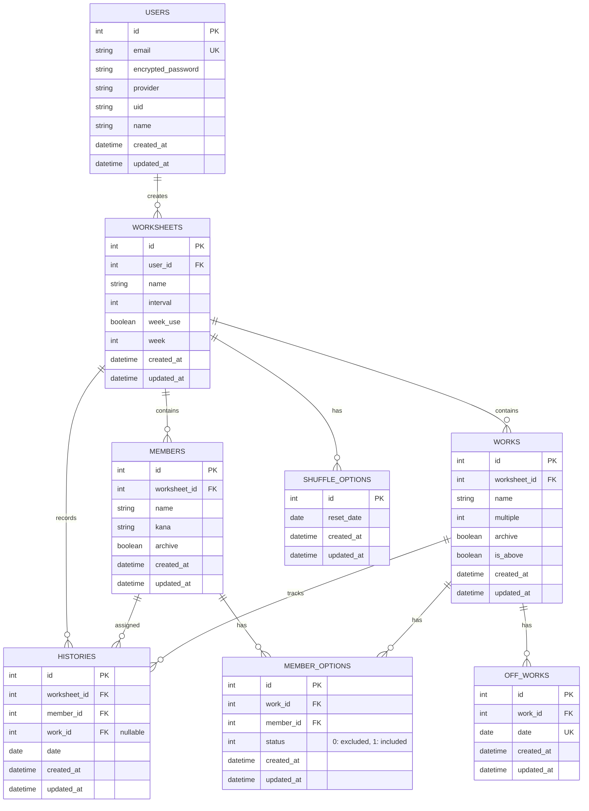

# タスクの割り当てシャッフルアプリ - TaskWheel

Rails 7 + React 18 + TypeScript + PostgreSQL + Docker + Tailwind CSSで構築された、マルチテナント対応のタスク割り当て管理アプリケーション。

## 📋 サービス概要

TaskWheel は、店舗・施設・学校など、定期的にタスク（シフト、当番、掃除など）を割り当てる必要がある組織のための**タスク自動割り当てシステム**です。メンバーの実績を考慮した公平で効率的な割り当てを自動化し、管理業務を大幅に削減します。

## 😤 表に見えている困りごと

- **手動割り当ての負担**: 毎回、誰にどのタスクを割り当てるか を決める必要がある
- **公平性の懸念**: 主観や人間関係によって割り当てが偏ってしまう
- **履歴管理の煩雑性**: 過去の割り当て実績を紙やスプレッドシートで管理するのが大変
- **メンバー管理の手間**: 新規・退職・配置変更に伴う更新作業が多い

## 🎯 解決したい課題

- ✅ **自動シャッフル機能**: ワンクリックで公平な割り当てを自動生成
- ✅ **実績ベースの配分**: 各メンバーの過去実績を自動計算して偏りのない割り当て
- ✅ **一元管理**: すべての割り当て履歴をシステムで一元管理
- ✅ **柔軟な切り替え**: 週単位・日数間隔・手動割り当てなど複数のモードに対応
- ✅ **例外対応**: 特定日にタスクを除外したり、メンバーが担当できないタスクを設定

## 👥 想定ユーザー

- **マンション・オフィスビルの管理組合員**: 当番制の掃除シフト管理
- **飲食店・小売店の店長**: シフト勤務スタッフの勤務日数調整
- **学校・保育園**: 学級当番・給食当番などの自動割り当て
- **病院・介護施設**: 看護実習生や介護スタッフの配置管理
- **イベント運営チーム**: ボランティア・スタッフのタスク割り当て

## 特徴

- **マルチテナント対応**: ユーザーごとに独立したワークシート管理
- **ユーザー認証**: Google OAuth + Devise によるセキュアなログイン
- **モダンなUI**: Tailwind CSS + React による レスポンシブデザイン
- **フルスタック TypeScript**: フロントエンド・バックエンド共に型安全
- **RESTful API**: Rails による マイクロサービスアーキテクチャ
- **自動テスト**: RSpec + Vitest による 包括的なテストカバレッジ
- **Docker対応**: 簡単なセットアップと開発環境の構築

## 機能

### 認証・ユーザー管理

- Google OAuth による ログイン
- メールアドレス・パスワード によるサインアップ
- パスワードリセット機能
- デモアカウント対応

### ワークシート管理

- 複数のワークシート（シフト管理セット）をサポート
- ワークシート名の編集
- ワークシートごとの独立したメンバー・タスク管理

### メンバー管理

- メンバー情報の登録・編集・削除
- 名前（フリガナ対応）の管理
- アーカイブ機能で過去メンバーを非表示化
- 一括インポート/エクスポート機能

### タスク管理

- タスク（掃除タスク）の登録・編集・削除
- 複数割り当て機能（multiple フラグ）
- 優先度管理（is_above フラグ）
- メンバーごとのタスク実績制限（MemberOption）
- 指定日のタスク除外（OffWork）

### 自動シャッフル

- ワンクリックでタスクを自動割り当て
- 週間モード/日数間隔モードの切り替え
- 公平性スコア計算による バランスの取れた割り当て
- メンバーごとの実績履歴を考慮

### 割り当て管理

- ダッシュボードでの日別タスク割り当て表示
- 割り当て先の変更機能
- 履歴管理

### 履歴管理

- タスク割り当ての履歴を記録
- 月ごとの履歴表示・検索
- メンバー・タスク単位での実績確認

### 技術スタック詳細

#### バックエンド

- **Rails 7.1**: マイクロサービス・REST API
- **Ruby 3.2**: 最新 Ruby 言語機能
- **PostgreSQL 15**: リレーショナルデータベース
- **Devise**: ユーザー認証フレームワーク
- **OmniAuth**: OAuth2 統合
- **RSpec**: テストフレームワーク
- **FactoryBot**: テストデータ生成

#### フロントエンド

- **React 18**: UI ライブラリ
- **TypeScript**: 型安全な JavaScript
- **Vite**: 高速ビルドツール
- **Tailwind CSS**: ユーティリティファースト CSS
- **Vitest**: 次世代テストフレームワーク
- **@testing-library/react**: React テストユーティリティ
- **Axios**: HTTP クライアント

### API エンドポイント

#### Authentication（認証）

```
POST   /users/sign_up              # ユーザー登録
POST   /users/sign_in              # ログイン
DELETE /users/sign_out             # ログアウト
POST   /users/password             # パスワードリセット
```

#### Worksheets（ワークシート）

```
GET    /api/v1/worksheets/:id            # ワークシート取得
PUT    /api/v1/worksheets/:id            # ワークシート更新
GET    /api/v1/worksheets/:id/dashboard  # ダッシュボード取得
POST   /api/v1/worksheets/:id/assign_member  # メンバー割り当て
```

#### Members（メンバー）

```
GET    /api/v1/worksheets/:worksheet_id/members              # メンバー一覧取得
POST   /api/v1/worksheets/:worksheet_id/members              # メンバー作成
GET    /api/v1/worksheets/:worksheet_id/members/:id          # メンバー取得
PUT    /api/v1/worksheets/:worksheet_id/members/:id          # メンバー更新
DELETE /api/v1/worksheets/:worksheet_id/members/:id          # メンバー削除
POST   /api/v1/worksheets/:worksheet_id/members/bulk_update  # 複数メンバー更新
POST   /api/v1/worksheets/:worksheet_id/members/import       # メンバーインポート
```

#### Works（タスク）

```
GET    /api/v1/worksheets/:worksheet_id/works              # タスク一覧取得
POST   /api/v1/worksheets/:worksheet_id/works              # タスク作成
GET    /api/v1/worksheets/:worksheet_id/works/:id          # タスク取得
PUT    /api/v1/worksheets/:worksheet_id/works/:id          # タスク更新
DELETE /api/v1/worksheets/:worksheet_id/works/:id          # タスク削除
POST   /api/v1/worksheets/:worksheet_id/works/shuffle      # シャッフル実行
```

#### Histories（履歴）

```
GET    /api/v1/worksheets/:worksheet_id/histories              # 履歴一覧取得
POST   /api/v1/worksheets/:worksheet_id/histories              # 履歴作成
DELETE /api/v1/worksheets/:worksheet_id/histories/:id          # 履歴削除
POST   /api/v1/worksheets/:worksheet_id/histories/bulk_create  # 複数履歴作成
```

#### MemberOptions（メンバーのタスク実績制限）

```
POST   /api/v1/worksheets/:worksheet_id/member_options  # オプション設定
DELETE /api/v1/worksheets/:worksheet_id/member_options  # オプション削除
```

#### OffWorks（タスク除外日）

```
POST   /api/v1/worksheets/:worksheet_id/off_works  # 除外日設定
```

## データベーススキーマ

### ER 図



### テーブル詳細

#### Users テーブル

ユーザー認証情報を管理します。

| カラム名           | 型       | 制約 | 説明                                  |
| ------------------ | -------- | ---- | ------------------------------------- |
| id                 | integer  | PK   | ユーザーID                            |
| email              | string   | UK   | メールアドレス                        |
| encrypted_password | string   |      | 暗号化パスワード                      |
| provider           | string   |      | OAuth プロバイダ（google-oauth2など） |
| uid                | string   |      | OAuth UID                             |
| name               | string   |      | ユーザー名                            |
| created_at         | datetime |      | 作成日時                              |
| updated_at         | datetime |      | 更新日時                              |

**関連付け:**

- `has_many :worksheets`（ユーザーが複数のワークシートを所有）

#### Worksheets テーブル

シフト・タスク管理のセット単位で区切られた独立した管理単位です。

| カラム名   | 型       | 制約           | 説明                                     |
| ---------- | -------- | -------------- | ---------------------------------------- |
| id         | integer  | PK             | ワークシートID                           |
| user_id    | bigint   | FK → users     | 所有ユーザー                             |
| name       | string   |                | ワークシート名（例：「2026年春シフト」） |
| interval   | integer  | NOT NULL       | リセット間隔（日数）                     |
| week_use   | boolean  | DEFAULT: false | 週間モード有効フラグ                     |
| week       | integer  | DEFAULT: 0     | 週の開始曜日                             |
| created_at | datetime |                | 作成日時                                 |
| updated_at | datetime |                | 更新日時                                 |

**関連付け:**

- `belongs_to :user`
- `has_many :members`
- `has_many :works`
- `has_many :histories`
- `has_many :shuffle_options`

#### Members テーブル

ワークシート内のメンバー（人員）情報を管理します。

| カラム名     | 型       | 制約            | 説明                 |
| ------------ | -------- | --------------- | -------------------- |
| id           | integer  | PK              | メンバーID           |
| worksheet_id | bigint   | FK → worksheets | 所属ワークシート     |
| name         | string   | NOT NULL        | メンバー名           |
| kana         | string   | NOT NULL        | フリガナ（カタカナ） |
| archive      | boolean  | DEFAULT: false  | アーカイブフラグ     |
| created_at   | datetime |                 | 作成日時             |
| updated_at   | datetime |                 | 更新日時             |

**関連付け:**

- `belongs_to :worksheet`
- `has_many :histories`
- `has_many :member_options`

#### Works テーブル

ワークシート内のタスク（掃除担当）情報を管理します。

| カラム名     | 型       | 制約            | 説明                 |
| ------------ | -------- | --------------- | -------------------- |
| id           | integer  | PK              | タスクID             |
| worksheet_id | bigint   | FK → worksheets | 所属ワークシート     |
| name         | string   | NOT NULL        | タスク名             |
| multiple     | integer  |                 | 複数割り当て人数上限 |
| archive      | boolean  | DEFAULT: false  | アーカイブフラグ     |
| is_above     | boolean  | DEFAULT: true   | 優先度（true=優先）  |
| created_at   | datetime |                 | 作成日時             |
| updated_at   | datetime |                 | 更新日時             |

**関連付け:**

- `belongs_to :worksheet`
- `has_many :histories`
- `has_many :member_options`
- `has_many :off_works`

#### Histories テーブル

メンバーへのタスク割り当て履歴を記録します。

| カラム名     | 型       | 制約                 | 説明                                   |
| ------------ | -------- | -------------------- | -------------------------------------- |
| id           | integer  | PK                   | 履歴ID                                 |
| worksheet_id | bigint   | FK → worksheets      | 所属ワークシート                       |
| member_id    | bigint   | FK → members         | 割り当てメンバー                       |
| work_id      | bigint   | FK → works, nullable | 割り当てタスク（未割り当ての場合NULL） |
| date         | date     | NOT NULL             | 割り当て日                             |
| created_at   | datetime |                      | 作成日時                               |
| updated_at   | datetime |                      | 更新日時                               |

**インデックス:**

- `worksheet_id`, `date`（ダッシュボード取得最適化）
- `member_id`, `date`（メンバーごとの実績確認）
- `work_id`（taタスクごとの実績確認）

**関連付け:**

- `belongs_to :worksheet`
- `belongs_to :member`
- `belongs_to :work, optional: true`

#### MemberOptions テーブル

メンバーごとのタスク実績制限（除外・対象設定）を管理します。

| カラム名   | 型       | 制約         | 説明                           |
| ---------- | -------- | ------------ | ------------------------------ |
| id         | integer  | PK           | オプションID                   |
| work_id    | bigint   | FK → works   | 対象タスク                     |
| member_id  | bigint   | FK → members | 対象メンバー                   |
| status     | integer  | NOT NULL     | ステータス（0: 除外, 1: 対象） |
| created_at | datetime |              | 作成日時                       |
| updated_at | datetime |              | 更新日時                       |

**約束:**

- `work_id` + `member_id` の組み合わせは一意（重複不可）

**関連付け:**

- `belongs_to :work`
- `belongs_to :member`

#### OffWorks テーブル

特定のタスクを指定日に除外する設定を管理します。

| カラム名   | 型       | 制約       | 説明         |
| ---------- | -------- | ---------- | ------------ |
| id         | integer  | PK         | 除外日設定ID |
| work_id    | bigint   | FK → works | 対象タスク   |
| date       | date     | NOT NULL   | 除外日       |
| created_at | datetime |            | 作成日時     |
| updated_at | datetime |            | 更新日時     |

**制約:**

- `work_id` + `date` の組み合わせは一意（重複不可）

**関連付け:**

- `belongs_to :work`

#### ShuffleOptions テーブル

自動シャッフル（タスク割り当て）のリセット日程を管理します。

| カラム名   | 型       | 制約 | 説明           |
| ---------- | -------- | ---- | -------------- |
| id         | integer  | PK   | オプションID   |
| reset_date | date     |      | 次回リセット日 |
| created_at | datetime |      | 作成日時       |
| updated_at | datetime |      | 更新日時       |

**関連付け:**

- グローバル設定（複数ワークシート間で共有）
